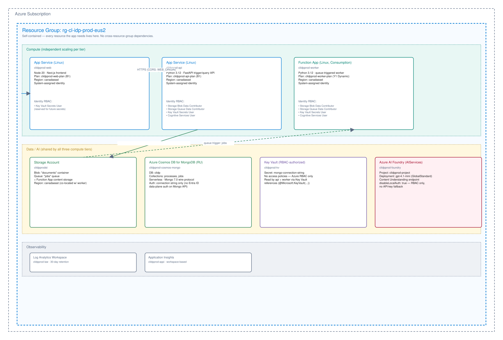

# Azure production topology (deployed)

## Purpose

This diagram documents the **actually deployed** Azure production environment for cl-idp, provisioned via Bicep in [`infra/`](../../infra/) into resource group `rg-cl-idp-prod-eus2`. Unlike [`canada-life-idp-enterprise-architecture.md`](./canada-life-idp-enterprise-architecture.md), which describes an aspirational **TARGET ENTERPRISE** design, everything shown here is live, verified infrastructure — a single, self-contained resource group with no cross-resource-group dependencies.

## Diagram

The editable source is [`canada-life-idp-azure-production-topology.excalidraw`](./canada-life-idp-azure-production-topology.excalidraw), also available in [online Excalidraw](https://excalidraw.core.microsoft/drawing/3055d216-24b4-4c7c-a35b-c2e93c53f455).

## What's shown

- **Compute tier** (independently scalable): `clidpprod-web` (App Service, Linux, Node 20, Next.js) and `clidpprod-api` (App Service, Linux, Python 3.12, FastAPI) each on their own B1 plan; `clidpprod-worker` (Function App, Linux, Consumption Y1) for queue-triggered background processing. All three use system-assigned managed identities — no secrets or keys are embedded in app code.
- **Data/AI tier** (shared by all three compute components): `clidpprodst` (Storage Account — blob `documents` container + `jobs` queue, also used as Function App content storage), `clidpprod-cosmos-mongo` (Azure Cosmos DB for MongoDB, serverless, replacing MongoDB Atlas), `clidpprod-kv` (Key Vault, RBAC-authorized, holding the Mongo connection string), and `clidpprod-foundry` (Azure AI Foundry / Cognitive Services `AIServices` kind, hosting the Content Understanding analyzer and a `gpt-4.1-mini` deployment, with `disableLocalAuth: true` so only Entra ID/RBAC calls are accepted).
- **Observability**: `clidpprod-law` (Log Analytics Workspace, 30-day retention) and `clidpprod-appi` (workspace-based Application Insights), with diagnostic settings streaming platform logs and metrics from every App Service and the Function App.
- **RBAC edges** (drawn as labeled arrows): each compute identity is granted only the data-plane roles it needs — e.g. `api`/`worker` get *Storage Blob Data Contributor*, *Storage Queue Data Contributor*, *Key Vault Secrets User* and *Cognitive Services User*; `web` only holds a reserved *Key Vault Secrets User* grant for future use. No component uses account keys or API keys for cross-resource access.

## Region note

App Service plans and the Function App plan are deployed in `canadaeast` (the parent App Service Service Plan `computeLocation`) due to zero `eastus2` compute quota in the target subscription at deployment time; all other resources (Storage, Cosmos, Key Vault, Foundry, Log Analytics) are in `eastus2`. See [`infra/README.md`](../../infra/README.md) for the full quota rationale and deployment log.

## Relationship to the enterprise target

This is the **CURRENT REPO** production deployment, not the **TARGET ENTERPRISE** design. It intentionally omits AKS, Service Bus, private networking/APIM, and MongoDB Atlas — those remain future-state per the enterprise architecture document. This topology proves the current codebase runs end-to-end on real Azure infrastructure with least-privilege RBAC and no local-auth fallbacks where avoidable.
