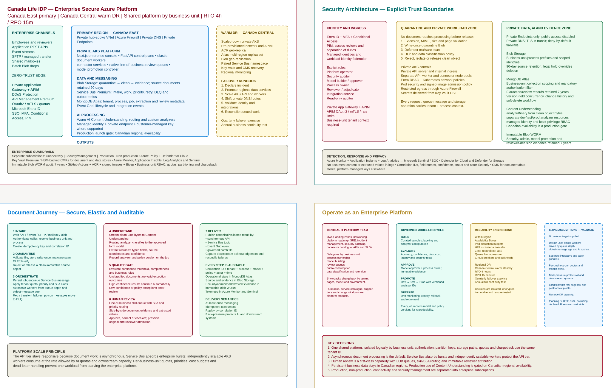

# Canada Life IDP enterprise architecture

## Purpose

This companion explains the intended enterprise architecture and the transition from the implementation in this repository. It is for enterprise architecture, Central IT platform and security teams, line-of-business (LOB) process owners, and delivery teams making launch and investment decisions.

Two labels are normative throughout:

- **CURRENT REPO** means capabilities evidenced in this repository: a Next.js console, FastAPI control plane, polling worker, Azure Blob Storage, Azure Storage Queue, MongoDB (default backend; Azure Cosmos DB for NoSQL remains available as a config-selectable fallback), Azure AI Content Understanding routing and custom analyzers, OpenTelemetry with an Application Insights export path, and SMTP review notifications.
- **TARGET ENTERPRISE** means the approved future-state design shown in the diagram. It is not a claim that those controls or services have been deployed.

This document defines boundaries, decisions, controls, recovery intent, and validation work. It is not a deployment guide, operating runbook, detailed threat model, or assurance attestation.

## Diagram

The board presents four complementary views: physical deployment and regional recovery; explicit security zones; the document journey; and the enterprise operating model. The editable source is [`canada-life-idp-enterprise-architecture.excalidraw`](./canada-life-idp-enterprise-architecture.excalidraw), also available in [online Excalidraw](https://excalidraw.core.microsoft/drawing/9d3f3e37-9a2f-496d-a374-1a6785971b60).

The detailed subscription, management-group, network, subnet, resource-placement, and environment-separation design is in the [physical architecture and Azure landing zone](./canada-life-idp-physical-landing-zone.md), whose authoritative Azure-style diagram is [`canada-life-idp-azure-landing-zone.svg`](./canada-life-idp-azure-landing-zone.svg).

The solid primary-region boundary represents **TARGET ENTERPRISE** production in Canada East. The dashed Canada Central boundary is warm DR, not active-active service. Data flows left to right from governed ingress through quarantine, asynchronous processing, quality gates and native LOB review to downstream case and claims systems. Trust is not inferred from network location: identity, tenant, process and correlation context must accompany requests, messages and data operations.

## Current-to-target mapping table

| Capability | CURRENT REPO | TARGET ENTERPRISE | Transition implication |
|---|---|---|---|
| User and API ingress | Next.js calls FastAPI directly; no application authorization layer is evident | Internal UI and controlled system API ingress through the Canada Life private network, internal Application Gateway and internal APIM; Entra ID, OAuth2 and mTLS as applicable | Add identity, policy enforcement, quotas and business-unit context without exposing an internet-facing application endpoint |
| Compute | API and a single-process polling worker run locally or in Compose | Production private AKS with independently scalable API, worker and connector pools | Containerize into governed images; add workload identity, autoscaling, network policy and admission controls |
| Intake | Web/REST multipart upload with extension, MIME, size and page checks | Web, REST, events, SFTP/MFT, shared mailboxes and batch Blob | Add managed connectors and idempotent intake contracts without coupling channels to processing |
| Documents | One Blob container and process/job paths; source bytes are directly available to the worker | Quarantine, clean and evidence zones with private endpoints, scan/classify/release controls and lifecycle policies | Preserve object identity while separating untrusted, released and evidentiary states |
| Messaging | Azure Storage Queue `jobs`; visibility timeout, dequeue count and delete-on-terminal behavior provide asynchronous, at-least-once work | Service Bus Premium for intake, work, priority, retry, DLQ and output topics | Replace the queue adapter and message contract transport; retain asynchronous acceptance, idempotent job handling, retries and correlation |
| State | MongoDB (`mongo:7` locally); jobs/processes keyed by their own `id`, indexed by `processId` — Cosmos DB for NoSQL remains available as a config-selectable fallback | MongoDB Atlas: multi-region replica set, tenant/process/job/extraction/review metadata partitioned and authorized by business unit | Move from a local single-node MongoDB container to an Atlas project with dedicated clusters per environment, Atlas PrivateLink connectivity, tenant keys, mandatory authorization filters, document versioning/concurrency and retention controls |
| AI | Content Understanding routing analyzer submits clean bytes to configured custom analyzers; credentials support key or `DefaultAzureCredential` | Separate dev/test/prod analyzer resources, managed identity, private communications and governed promotion | Add evaluation evidence, approvals, canary, rollback and region assurance |
| Review | Confidence violations drive in-console field correction; SMTP notifies process owner | Native LOB review queues with skill, priority and SLA routing, escalation and immutable attribution | Extend the existing review state rather than procuring a detached review workflow |
| Outputs | Job polling/read APIs; SMTP notification | Synchronous API, Service Bus topics, Event Grid and governed batch files to case/claims platforms | Define canonical result, acknowledgement, reconciliation and replay contracts |
| Observability/audit | Correlation-aware OpenTelemetry traces, metrics and logs; Application Insights trace exporter path | Azure Monitor, Application Insights, Log Analytics and Sentinel plus immutable Blob WORM audit | Separate operational telemetry from seven-year decision and control evidence |

## Architecture decisions

1. **Regional topology.** Canada East is primary and Canada Central is warm DR. Production business data persists in Canada. The trade-off is lower steady-state DR cost versus a recovery period and explicit regional promotion.
2. **Production runtime and network.** Production runs on private AKS in a hub-spoke topology. Separate subscriptions cover connectivity, security/management, production and non-production. Canada Life WAN or approved private Azure networks reach a private Application Gateway frontend and internal APIM; internal UI paths and system APIs receive distinct policies, and no internet-facing application endpoint is deployed.
3. **Shared platform, delegated operation.** Central IT owns and operates the platform, SRE, security posture, APIs and connector catalogue. LOBs receive delegated process ownership, model building, review and quota responsibilities. The platform is multitenant, with isolation by Canada Life business unit across authorization, partitioning, storage paths, quotas and chargeback—not merely a UI label.
4. **Asynchronous core.** Document processing remains asynchronous so intake can acknowledge durably while workers scale and downstream dependencies throttle. Migration from Storage Queue to Service Bus Premium must preserve at-least-once semantics, correlation IDs, durable job state, bounded retries and idempotent consumers. Service Bus adds priority lanes, topic fan-out, DLQs, stronger isolation and back-pressure; duplicate detection does not remove the need for idempotency.
5. **Human review is native.** Confidence and policy exceptions enter LOB-owned queues with skill/SLA routing. Reviewers see source evidence, correct or adjudicate values, and retain original extraction plus actor attribution.
6. **Governed model lifecycle.** Models move dev to test to prod only after repeatable evaluation and model-approver/process-owner approval. Versioned analyzer and policy IDs are recorded per job. Production promotion uses canary observation with a defined rollback target.
7. **Enterprise delivery contracts.** Validated results leave through synchronous APIs, Service Bus topics, Event Grid, or governed batch files. Downstream case/claims acknowledgements and failures are reconcilable by correlation ID.

## Security and data controls

The platform handles PII, PHI and financial information. Canadian persistence is required; cross-region processing is not implicitly authorized. Public access to workload data services is disabled. Hub-spoke routing, Azure Firewall, private DNS and private endpoints constrain Blob, Key Vault and AI access; MongoDB Atlas is reached over **Atlas PrivateLink** into the same hub-spoke VNet rather than an Azure-native private endpoint, since Atlas is a managed third-party service and not an in-subscription Azure resource. TLS protects data in transit to every dependency, including the Atlas cluster. Customer-managed keys protect document stores; Atlas encryption at rest uses Atlas-managed keys by default, with customer/Azure Key Vault-managed keys (BYOK) enabled where policy requires it. Platform-managed keys are used elsewhere unless risk assessment requires CMK.

Every request, message and storage operation carries business-unit, process and correlation context. Entra groups, managed identities, MFA, Conditional Access, PIM, access reviews and separation of duties implement least privilege. Explicit roles are: platform operator, security auditor, model builder, model approver, process owner, reviewer/adjudicator, integration service and read-only auditor. Model builder and approver duties remain separable.

No submitted object reaches AI processing before full quarantine validation: extension/MIME/size/page validation, write-once quarantine storage, Defender malware scanning, DLP classification, then release of a clean object or rejection/isolation. Logs exclude document content and extracted values.

Source documents are retained for 90 days. Extracted/review records and immutable audit evidence are retained for seven years. Legal hold overrides normal deletion. Security, administrative, model-promotion and reviewer-decision evidence is written to immutable Blob WORM storage; operational telemetry flows through Azure Monitor, Application Insights and Log Analytics into Sentinel. Retention, WORM policy and key recovery must be tested as controls, not assumed from service selection.

## Availability/DR

The planning objectives are **RTO 4 hours** and **RPO 15 minutes**. Within Canada East, the target uses availability-zone-aware AKS, pod disruption budgets, horizontal and cluster autoscaling, and zone-redundant PaaS where supported. Queue back-pressure, retries, circuit breakers and bulkheads isolate AI and downstream degradation.

Canada Central maintains scaled-down private AKS, pre-provisioned network/APIM, ACR replication, data replicas or recoverable copies, Service Bus recovery capability, recoverable Key Vault/CMK material and regional monitoring. Private DNS and internal routes change after data promotion and AKS scale-out. The design must prove how in-flight work is recovered or reconciled from durable job state within the RPO, including broker replication lag and duplicate delivery.

Backups are isolated, encrypted, immutable and restore-tested. Quarterly regional failover exercises and an annual business-continuity test validate identity, private DNS, keys, connectors, queue reconciliation and downstream delivery—not only cluster startup. The objectives remain planning values until dependency-specific recovery tests demonstrate them.

## Scale assumptions to validate

No production volume target has been supplied; this architecture does not invent one. Sizing requires measured inputs before capacity or cost approval.

| Input to validate | Evidence required | Design decision informed |
|---|---|---|
| Documents/pages per day, peak arrival rate and burst duration by LOB/channel | Forecast plus representative arrival traces | Service Bus units, AKS baseline and autoscale limits |
| File/page-size distribution, formats and complexity | Production-like corpus with data-handling approval | Blob capacity, worker memory, timeout and quarantine throughput |
| AI latency, pages/second, concurrency, quotas and throttling by analyzer | Load test using the expected model/page mix | Worker concurrency, back-pressure and quota reservation |
| Interactive versus batch priority and end-to-end SLA | LOB service-class inventory | Queue/topic topology, priority allocation and review deadlines |
| Confidence exception rate and reviewer handling time by skill | Controlled pilot results | Review staffing, queue routing and maximum backlog |
| Retention growth, audit-event rate and legal-hold prevalence | Records/privacy forecast | Atlas cluster tier/storage sizing, Blob/WORM capacity and lifecycle cost |
| Downstream rate limits, outage duration and replay tolerance | Interface agreements and resilience tests | Output buffering, retry, circuit breaking and reconciliation |
| Warm-region minimum capacity and concurrent failover demand | DR load test against RTO/RPO | Reserved capacity and scale-out threshold |

Acceptance criteria and owners belong in the delivery plan; final sizing follows representative performance and failover tests.

## Known launch gate

**Production is blocked by regional assurance for Azure AI Content Understanding.** Microsoft’s language and region support documentation, updated **2026-08-25**, does not list Canadian regions. Canadian availability in this diagram is therefore a **user-directed future-state assumption**, not a currently documented service capability.

The gate closes only when Canada Life verifies supported Canadian regional availability and required secure-communications features in the intended subscription, **or** approves a documented architecture exception or replacement service that satisfies residency, privacy, security and records obligations. Evidence must include the Microsoft support statement or deployed-service validation, privacy/security and legal approval, and successful private-path and recovery testing. Until then, no production architecture should represent Content Understanding processing in Canada as confirmed.

## Azure references

- [Azure AI Content Understanding language and region support](https://learn.microsoft.com/en-us/azure/ai-services/content-understanding/language-region-support) — authoritative launch-gate source; page updated 2026-08-25.
- [Secure communications for Azure AI Content Understanding](https://learn.microsoft.com/en-us/azure/ai-services/content-understanding/concepts/secure-communications) — basis for validating identity, network isolation and private communication capabilities.
- [Baseline architecture for an AKS multi-region cluster](https://learn.microsoft.com/en-us/azure/architecture/reference-architectures/containers/aks-multi-region/aks-multi-cluster) — reference for independent regional clusters, routing and recovery design; it does not replace Canada Life RTO/RPO testing.

## MongoDB Atlas references

- [Deploy MongoDB Atlas in Azure — Azure Architecture Center](https://learn.microsoft.com/en-us/azure/architecture/databases/architecture/mongodb-atlas-baseline) — Microsoft-published reference architecture for Atlas on Azure, including private connectivity guidance.
- [Configure Private Endpoints for MongoDB Atlas](https://www.mongodb.com/docs/atlas/security-private-endpoint/) — Atlas PrivateLink setup for private connectivity from a customer VNet without traversing the public internet.
- [Atlas Global Clusters (multi-region)](https://www.mongodb.com/docs/atlas/global-clusters/) — electable/read-only/analytics node placement across regions, the basis for the Canada East/Canada Central replica-set design in this document.
- [MongoDB Atlas Cloud Backup](https://www.mongodb.com/docs/atlas/backup/cloud-backup/overview/) — continuous cloud backup, snapshot scheduling, point-in-time restore and retention policy configuration used for the RPO 15-minute planning target.
