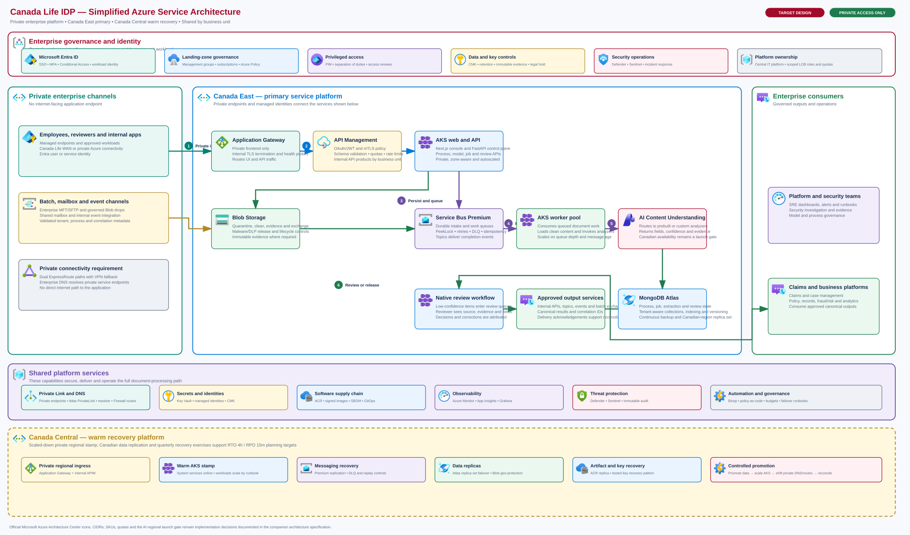

# Canada Life IDP physical landing zone

## Purpose, audience, and status

This document defines the target Azure landing-zone placement and physical deployment model for the Canada Life intelligent document processing (IDP) platform. It is written for enterprise, cloud, and platform architects and for the implementation teams that will turn approved architecture into infrastructure. The explanatory sections state why boundaries and controls exist; the reference sections provide concrete hierarchy, subscription, network, service, ownership, and recovery specifications. It is deliberately not a deployment tutorial or an operational runbook.

This is **TARGET architecture and is not deployed**. The current repository implements a Next.js web application, FastAPI API, polling worker, Azure Blob Storage, Azure Storage Queue, MongoDB (default backend; Azure Cosmos DB for NoSQL remains available as a config-selectable fallback), Azure AI Content Understanding, and OpenTelemetry (OTel), with an Application Insights export path. The companion [enterprise architecture](./canada-life-idp-enterprise-architecture.md) defines the business boundaries, security zones, document journey, current-to-target transition, and launch gate. This page complements it by locating the target capabilities in the Canada Life Azure estate — and the adjacent MongoDB Atlas estate it privately connects to — rather than repeating those logical decisions.

## Architecture view



The authoritative visual is [`canada-life-idp-azure-landing-zone.svg`](./canada-life-idp-azure-landing-zone.svg). It intentionally presents a simplified service-interaction view for enterprise architecture and executive discussions: private intake, API policy, asynchronous document processing, AI extraction, human review, governed delivery, shared controls, and Canadian recovery. The detailed subscription, network, subnet, policy, SKU, and operating specifications remain in this document rather than being repeated inside the diagram. The SVG is generated by [`generate-azure-landing-zone-diagram.mjs`](./generate-azure-landing-zone-diagram.mjs) from the official Microsoft Azure Architecture Center V24 service icons stored under [`assets/azure-icons`](./assets/azure-icons/). Regenerate it with:

```bash
node docs/architecture/generate-azure-landing-zone-diagram.mjs
```

The earlier [`canada-life-idp-physical-landing-zone.excalidraw`](./canada-life-idp-physical-landing-zone.excalidraw) board is retained only as a narrative working view. It is **not** the authoritative Azure physical topology.

The Azure-style view separates enterprise shared services from workload subscriptions and makes every principal service, regional network, subnet, private endpoint group, recovery resource, and traffic path visible. Shared connectivity and security are not embedded in the IDP subscription because their policy, lifecycle, evidence, and blast radius are enterprise concerns. Conversely, IDP compute and data remain in workload subscriptions so Central IT can operate the product without receiving control of shared network or security services.

## Explanation: placement rationale

### Management-group boundaries

The hierarchy applies enterprise policy above individual subscriptions while preserving a distinct boundary for regulated workloads:

```text
Tenant Root
└── Canada Life
    ├── Platform
    │   ├── Connectivity
    │   ├── Management & Security
    │   └── Identity tenant services
    ├── Landing Zones
    │   ├── Corp
    │   └── Regulated
    │       └── IDP
    ├── Sandbox
    └── Decommissioned
```

IDP belongs below **Landing Zones > Regulated > IDP** because its documents and extracted records can contain PII, PHI, and financial information. Connectivity and management controls inherit from the **Platform** branch rather than being delegated to the workload. Sandbox subscriptions cannot become an informal route to production, and retired subscriptions move to **Decommissioned** for deny-oriented governance and closure.

Identity is primarily a tenant-level service, not an IDP workload subscription. Entra tenant configuration, Conditional Access, privileged access governance, identity lifecycle, and authoritative groups therefore sit under the enterprise identity operating model. Workload subscriptions contain managed identities, role assignments, and identity-dependent resources, but do not own the tenant control plane.

### Regional and service boundaries

Canada East is the production primary region; Canada Central is warm disaster recovery (DR). Independent regional AKS stamps, regional ingress components, private endpoints, and recoverable data services avoid treating one cluster or virtual network as a two-region unit. Warm DR lowers steady-state cost but makes promotion, scale-out, message reconciliation, and route change explicit recovery actions. Availability zones address failures within a region; the second region addresses regional loss.

Private endpoints keep workload data paths off public service endpoints, but they do not replace identity or authorization. Managed identity (MI), business-unit context, least-privilege data-plane roles, customer-managed keys (CMK), and auditable control-plane actions remain required. Hub-spoke networking centralizes inspection and hybrid connectivity without making the hub an application runtime.

## Reference: management and subscription inventory

| Subscription | Placement and scope | Purpose and principal owner |
|---|---|---|
| `cl-plat-connectivity-prd` | Platform > Connectivity; shared across Canadian regions | Regional hubs, ExpressRoute (ER)/VPN, Azure Firewall Premium, Bastion, Private DNS Resolver, and DDoS protection. Owned by **Network Services**. |
| `cl-plat-mgmtsec-prd` | Platform > Management & Security; enterprise shared | Log Analytics, Microsoft Sentinel, Automation, Azure Monitor Private Link Scope, central immutable audit, Defender for Cloud, and policy remediation. Owned by **Cloud Platform/Cyber Defence** according to service responsibility. |
| `cl-idp-prod` | Landing Zones > Regulated > IDP | Canada East primary and Canada Central warm-DR stamps, including production AKS and production PaaS. Owned and operated by **Central IT IDP**, within inherited enterprise controls. |
| `cl-idp-nonprod` | Landing Zones > Regulated > IDP | Development, integration, performance, and preproduction environments, with AKS/PaaS separate from production. It must contain no production data. Owned by **Central IT IDP**. |

Resource groups align lifecycle, region, and operational ownership rather than representing security boundaries. Illustrative production names include `rg-idp-prd-cae-network`, `rg-idp-prd-cae-aks`, `rg-idp-prd-cae-data`, `rg-idp-prd-cac-dr`, and `rg-idp-shared-global`. These examples are subject to Canada Life naming, tagging, resource-group, and lifecycle standards; the global group is only for genuinely non-regional resources.

## Reference: illustrative network allocation

All prefixes below are **illustrative and subject to enterprise IPAM approval and overlap checks**. AKS ranges additionally require sizing from the selected Azure CNI mode, pod density, surge behavior, node limits, and upgrade headroom.

| Network or subnet | Illustrative CIDR | Function |
|---|---:|---|
| Canada East hub | `10.100.0.0/16` | Primary ER/VPN connectivity, firewall, DNS resolution, Bastion, and shared inspection |
| Canada Central hub | `10.101.0.0/16` | DR regional connectivity and equivalent shared services |
| Production primary spoke | `10.120.0.0/16` | Canada East IDP production stamp |
| `appgw` subnet | `10.120.1.0/24` | Internal regional Application Gateway with a private frontend |
| `apim` subnet | `10.120.2.0/24` | Private or injected API Management tier |
| AKS system subnet | `10.120.16.0/20` | Cluster system nodes and platform pods |
| AKS workload subnet | `10.120.32.0/19` | API, worker, and connector workloads |
| Private endpoint subnet | `10.120.64.0/24` | Workload PaaS private endpoints |
| Integration subnet | `10.120.65.0/24` | Controlled connector and integration components |
| Production DR spoke | `10.121.0.0/16` | Canada Central warm stamp, using matching subnet purposes and relative sizing |
| Nonproduction spoke | `10.122.0.0/16` | Isolated nonproduction AKS, PaaS, endpoints, and integration paths |

Spokes peer only to their regional hub; transit, route tables, and Firewall Premium policy provide inspected egress and approved east-west/hybrid paths. Private DNS zones are centrally governed and linked where resolution is required. Network security groups remain defense in depth, while application authorization and PaaS data-plane roles enforce access regardless of source network.

## Reference: physical traffic paths

| Path | Physical route and control intent |
|---|---|
| Internal API | Approved Canada Life workload → private corporate or Azure network → internal Application Gateway → internal APIM → private AKS API; Entra OAuth2 and mTLS are applied by client class. No internet-facing application endpoint is provided. |
| Employee UI | Managed employee endpoint → Canada Life corporate network/private access → regional ingress → Next.js UI and FastAPI on private AKS; Entra authentication, Conditional Access, and business-unit authorization apply. |
| Batch, MFT, and mailbox | Enterprise MFT, managed mailbox, or batch landing service → inspected integration path → connector pool → quarantine Blob. Connectors normalize metadata and correlation without bypassing validation. |
| Processing | Quarantine scan/classification → clean Blob → Service Bus Premium work item → worker pool → Content Understanding → MongoDB Atlas (via Atlas PrivateLink) job/extraction state and evidence storage. Retries remain idempotent. |
| Human review | Employee path → review UI/API → source evidence and extraction records through private endpoints; reviewer identity, decision, before/after values, and reason are immutably attributed. |
| Outputs | API/APIM, Service Bus topics, Event Grid, or governed exchange Blob/MFT → case and claims consumers; acknowledgements and correlation IDs support reconciliation. |
| Management plane | PIM-authorized administrator → hardened managed workstation/Bastion or approved private management path → Azure control plane and private cluster administration; diagnostics flow privately to central monitoring. |
| CI/CD | Approved pipeline identity → signed artifact/image controls → ACR → GitOps reconciliation or controlled Helm release to private AKS; infrastructure changes pass policy and separation-of-duties gates. |

## Reference: workload platform specification

### AKS

Production uses private, availability-zone-aware AKS clusters with Uptime SLA and separate **system**, **API/worker**, and **connector** node pools. The system pool starts with at least three nodes; each production user pool starts with at least two nodes and scales from measured demand. Pool separation permits distinct scaling, taints, egress permissions, and disruption policies; connectors do not inherit broad data-plane access merely because they run in the same cluster. The final Azure CNI and network-policy implementation must satisfy enterprise IPAM, upgrade-surge capacity, pod density, and namespace/workload isolation.

Horizontal Pod Autoscaler and cluster autoscaler address workload and node demand. Pod requests/limits, disruption budgets, topology spread, zone-aware placement, readiness probes, and controlled upgrades preserve capacity during maintenance. Workload identity replaces embedded credentials; the Key Vault CSI driver supplies secrets or certificates that cannot use token-based access directly. Images are signed, scanned, admitted by policy, and pulled from private ACR. Egress traverses Firewall Premium with explicit destinations; Firewall SNAT capacity is load-tested and a NAT Gateway on the firewall subnet is evaluated if connection volume requires it. Azure Backup protects supported cluster/application state, and regional restore is tested rather than assumed. ACR geo-replication makes approved images available to Canada Central. Deployment uses GitOps or controlled Helm with immutable versions, approval evidence, drift detection, and rollback.

### PaaS and data

| Service | Target use and physical controls |
|---|---|
| Application Gateway and API Management | Regional Application Gateway v2 exposes only a private frontend and provides internal ingress, end-to-end TLS, and health probing. Production API Management uses an availability-zone-capable tier with at least two units, autoscaling, private networking, JWT/mTLS validation, schema controls, quotas/rate limits, backend circuit breakers, and IaC/APIOps synchronization to the recovery region. |
| Blob Storage | Separate quarantine, clean, evidence, and exchange containers/accounts as risk and immutability require; lifecycle, malware/DLP release gates, WORM evidence, versioning, and recovery settings follow data class. |
| Service Bus Premium | Zone-redundant intake/work queues, priority lanes, retries, dead-letter queues, and output topics with private access and dedicated capacity. Use `PeekLock`, bounded TTL and delivery counts, duplicate detection, concurrent receivers, and sessions only where ordering is required. Configure Premium geo-replication where supported and retain application-level idempotency and replay. |
| MongoDB Atlas | Durable process, job, extraction, review, and reconciliation records. Atlas dedicated cluster (M-tier or higher) with a multi-region replica set — Canada East electable members plus a Canada Central electable/read-only member for warm-standby recovery — reached exclusively via **Atlas PrivateLink** into the hub-spoke VNet (no public IP access). Continuous cloud backup with point-in-time restore, encryption at rest (Atlas-managed keys, or Azure Key Vault-managed BYOK where policy requires it), and client-side driver retry (`retryWrites`/`retryReads`) support Canadian recovery. Collections are scoped by tenant/process context and validated against hot-partition access patterns via Atlas Performance Advisor. |
| Key Vault Premium | Keys, certificates, and exceptional secrets; private access, HSM-backed keys where required, purge protection, rotation, and recoverable DR key material. |
| Azure Container Registry | Private, scanned, signed image supply with Canada East/Canada Central availability through geo-replication. |
| Content Understanding | Target AI processing assumes future availability in Canada; regional and secure-communications support remain a launch gate, not a current fact. |

All workload PaaS services use private endpoints and governed private DNS. Public network access is disabled. Managed identities are the default for service-to-service access. CMK applies to document and regulated data stores where policy requires it; key ownership, custodianship, rotation, backup, revocation, and recovery must be defined before production.

## Reference: policy and data guardrails

The IDP management group receives policy initiatives for allowed Canadian regions; denial of public network access; required private endpoints and DNS integration; diagnostics to central destinations; minimum TLS; managed identity; CMK where mandated; Defender plans; required tags, budgets, and resource locks; and the approved AKS baseline. Policy remediation is centrally visible. Exceptions require a named risk owner, compensating controls, approval, expiry date, and review; permanent or silently renewed exceptions are not acceptable.

Nonproduction has separate AKS, identities, keys, Service Bus, MongoDB Atlas projects, Storage, AI resources, private endpoints, and quotas. Production data must not enter nonproduction. Tests use synthetic or formally approved de-identified data. Promotion moves versioned code, infrastructure definitions, policies, analyzer definitions, and evaluation evidence—not databases, documents, queue contents, credentials, or production configuration exports. Nonproduction cannot route directly to production data planes, and performance testing must not consume production quotas.

## Reference: RBAC, RACI, and privileged access

| Party | Accountable scope | Consulted or constrained scope |
|---|---|---|
| Network Services | Hubs, ER/VPN, Firewall Premium, DDoS, DNS Resolver, routing, and IPAM | Spoke requirements, private endpoint resolution, ingress/egress changes |
| Cloud Platform / Cyber Defence | Management-group controls, policy, Defender, central monitoring, Sentinel, immutable audit, and security response | Workload remediation and approved exceptions |
| Central IT IDP | Production/nonproduction workload, AKS, PaaS, SRE, APIs, connector catalogue, delivery, and recovery | Operates within shared network, identity, security, and records controls |
| LOB teams | Scoped process ownership, model definition/promotion participation, review/adjudication, service expectations, and data-use approval | No platform-wide administration or cross-LOB access |

No person or delivery identity receives standing **Owner** access. Privileged roles use Entra PIM, MFA, approval, time limits, justification, logging, and access reviews. Automation identities receive narrow resource-level roles; emergency access is separately controlled and tested.

## Explanation: recovery model

The planning objectives are **RTO 4 hours** and **RPO 15 minutes**. A regional runbook must cover incident declaration; write fencing; MongoDB Atlas and Storage promotion or recovery; Key Vault/CMK availability; DR AKS scale-out; APIM/ingress health; private DNS and internal route change; connector restart; output reconciliation; and service validation. For MongoDB Atlas, "promotion" means an Atlas-managed **replica-set election** that promotes a Canada Central electable member to primary — not a manual failover procedure — triggered automatically on primary-region unavailability and monitored via Atlas alerts; the runbook validates the election completed and driver reconnection succeeded rather than performing the promotion itself. Incomplete work is recreated from durable process/job records in MongoDB Atlas and immutable input references rather than assumed to survive in a broker.

Service Bus Premium should use geo-replication where the selected regions and configuration support it. The replication mode is chosen against the latency and RPO trade-off, and monitoring must cover replication lag, active messages, throttling, server errors, delivery success, and dead-letter growth. Regional exercises must still validate promotion, duplicate handling, ordering assumptions, lock loss, dead-letter recovery, and application replay from durable job records held in MongoDB Atlas. Broker replication reduces risk but does not remove the requirement for idempotent processing and reconciliation.

## Azure Well-Architected Framework alignment

The physical design was reviewed against the five Azure Well-Architected Framework pillars, the current AKS, Service Bus, and API Management service guides, and MongoDB's Atlas production readiness and multi-region deployment guidance. This is an architecture alignment, not a completed production assessment; Canada Life should run the formal Azure Well-Architected Review and retain the resulting actions and risk acceptances before launch.

| Pillar | Controls represented in the design | Evidence still required |
|---|---|---|
| Reliability | Availability-zone-aware AKS and PaaS, AKS Uptime SLA, isolated system/user pools, PDBs, readiness probes, multi-region MongoDB Atlas replica set, Service Bus zone redundancy and geo-replication, warm regional AKS, durable job replay, continuous Atlas backup, quarterly failover | Dependency failure-mode analysis, measured RTO/RPO, restore results, forced-failover tests, message-loss/duplicate tests |
| Security | Entra ID as the primary identity perimeter, PIM, managed/workload identities, internal Application Gateway/APIM, private clusters and endpoints, Firewall controls, CMK, signed-image admission, Defender and Sentinel, quarantine/malware/DLP processing | Threat model, penetration test, role/permission review, private DNS and egress validation, Content Understanding regional/security assurance |
| Cost optimization | Independent worker scaling, queue load leveling, Premium capacity chosen from measured demand, per-LOB quotas/showback, budgets, nonproduction limits, warm rather than active-active DR | Volume/page forecasts, AI quota and unit-cost model, reserved-capacity analysis, idle-resource automation and monthly cost review |
| Operational excellence | Bicep, policy-as-code, OIDC delivery identities, signed artifacts, GitOps/controlled Helm, progressive rollout, health telemetry, correlation IDs, immutable evidence, runbooks and clear ownership | Operational readiness review, on-call exercises, deployment rollback tests, alert quality/SLO burn-rate validation, documented support model |
| Performance efficiency | Horizontal scaling, queue-depth and oldest-message autoscaling, concurrent Service Bus receivers, connection reuse, back-pressure, partition-key design, API quotas and representative load testing | Peak/burst workload profile, worker concurrency and prefetch tuning, RU hot-partition tests, APIM/AKS/AI saturation tests, failover-capacity test |

### Messaging configuration baseline

- Use queues for point-to-point load leveling and topics/subscriptions for fan-out. Avoid using ordering features globally when only selected business processes require them.
- Receive in `PeekLock` mode, renew locks for long AI operations, settle only after durable job state is committed, and treat duplicate delivery as normal.
- Configure finite TTL, maximum delivery count, exponential backoff, circuit breakers, and explicit dead-letter ownership. Alert on DLQ growth and oldest-message age.
- Enable duplicate detection with stable message IDs, but keep consumers idempotent because the detection window is bounded.
- Size Premium messaging units from ingress and egress bytes, burst tests, subscriptions, batching, prefetch, sessions, and regional replication—not document count alone.
- Use separate production and nonproduction namespaces. Consider additional namespace isolation if one LOB or critical flow can exhaust shared capacity.

## Reference: implementation sequence

This is dependency order for planning and assurance, not a command-by-command procedure:

1. Confirm Azure Landing Zone integration and management-group placement.
2. Establish production/nonproduction subscriptions, policy inheritance, budgets, and privileged-access boundaries.
3. Provision regional hubs, hybrid connectivity, DNS, inspection, and approved IP allocations.
4. Establish isolated production and nonproduction spokes and the warm-DR spoke.
5. Connect central monitoring, Defender, Sentinel, immutable audit, and policy remediation.
6. Deploy private PaaS, data protection, keys, replication, and recovery configuration.
7. Deploy private AKS stamps, pools, identities, admission controls, and autoscaling.
8. Establish signed-image CI/CD and GitOps or controlled Helm promotion.
9. Add governed intake/output connectors and least-privilege routes.
10. Complete DR scale, promotion, replay, and failback mechanisms.
11. Validate representative load, security controls, penetration findings, and end-to-end DR before production approval.

## Open decisions and required evidence

| Decision | Evidence needed before approval |
|---|---|
| Enterprise IPAM and subnet plan | Confirmed non-overlap, hybrid routes, CNI model, pod/node maxima, upgrade surge, and DR capacity |
| Final SKUs and capacity | Measured throughput, latency, burst, quota, resiliency, and cost results |
| Volumes and page mix | LOB forecasts plus representative documents, sizes, page counts, formats, and analyzer complexity |
| Availability-zone support | Intended region/SKU support and tested zone-failure behavior for every critical service |
| Internal Application Gateway and APIM ingress | Validated private frontend, certificate/DNS flow, regional route failover, and proof that no unintended public listener or bypass exists |
| Content Understanding in Canada | Microsoft-confirmed Canadian availability and required private/security features, or an approved alternative/exception |
| CMK custodians | Named owners, separation of duties, rotation, escrow/recovery, revocation, and emergency procedures |
| Downstream SLAs | Rate limits, outage tolerance, acknowledgements, replay, ordering, and reconciliation contracts |
| Review staffing | Confidence-exception rate, skill mix, handling time, hours of coverage, escalation, and maximum backlog |

## References

- [Azure landing zone management groups and resource organization](https://learn.microsoft.com/en-us/azure/cloud-adoption-framework/ready/landing-zone/design-area/resource-org-management-groups)
- [Azure Kubernetes Service landing zone accelerator](https://learn.microsoft.com/en-us/azure/cloud-adoption-framework/scenarios/app-platform/aks/landing-zone-accelerator)
- [Hub-spoke network topology in Azure](https://learn.microsoft.com/en-us/azure/architecture/networking/architecture/hub-spoke)
- [Baseline architecture for an AKS multi-region cluster](https://learn.microsoft.com/en-us/azure/architecture/reference-architectures/containers/aks-multi-region/aks-multi-cluster)
- [Azure AI Content Understanding language and region support](https://learn.microsoft.com/en-us/azure/ai-services/content-understanding/language-region-support)
- [Secure communications for Azure AI Content Understanding](https://learn.microsoft.com/en-us/azure/ai-services/content-understanding/concepts/secure-communications)
- [Azure Well-Architected Framework](https://learn.microsoft.com/en-us/azure/well-architected/)
- [Architecture best practices for Azure Kubernetes Service](https://learn.microsoft.com/en-us/azure/well-architected/service-guides/azure-kubernetes-service)
- [Architecture best practices for Azure Service Bus](https://learn.microsoft.com/en-us/azure/well-architected/service-guides/azure-service-bus)
- [Architecture best practices for Azure API Management](https://learn.microsoft.com/en-us/azure/well-architected/service-guides/azure-api-management)
- [Deploy MongoDB Atlas in Azure — Azure Architecture Center](https://learn.microsoft.com/en-us/azure/architecture/databases/architecture/mongodb-atlas-baseline)
- [Configure Private Endpoints for MongoDB Atlas](https://www.mongodb.com/docs/atlas/security-private-endpoint/)
- [Atlas Global Clusters (multi-region)](https://www.mongodb.com/docs/atlas/global-clusters/)
- [MongoDB Atlas Cloud Backup](https://www.mongodb.com/docs/atlas/backup/cloud-backup/overview/)
